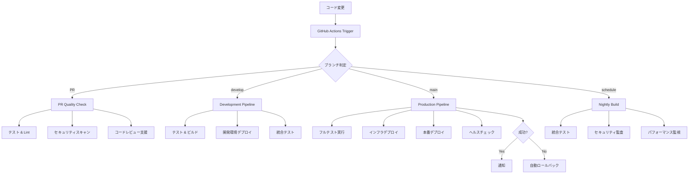

# 🚀 POSL CI/CD パイプライン設計書

## 📋 概要

POSLプロジェクトの完全自動化されたCI/CDパイプラインです。テスト→ビルド→デプロイの全プロセスを自動化し、高品質なソフトウェアの継続的デリバリーを実現します。

## 🏗️ アーキテクチャ

### パイプライン構成



## 📁 ワークフローファイル

### 1. メインCI/CDパイプライン (`ci-cd-pipeline.yml`)

**トリガー:**
- `main`ブランチへのpush → 本番デプロイ
- `develop`ブランチへのpush → 開発環境デプロイ
- Pull Requestの作成・更新

**ジョブ構成:**

#### 🧪 テストフェーズ
- **Backend Test**: TypeScript型チェック、Lint、Jest単体テスト (MySQL付き)
- **Frontend Test**: TypeScript型チェック、Lint、Next.js ビルド
- **Infrastructure Validate**: Terraform検証とプラン実行

#### 🔒 セキュリティフェーズ
- **Security Scan**: Trivyによる脆弱性スキャン

#### 🚀 デプロイフェーズ
- **Development Deploy**: 開発環境への自動デプロイ
- **Production Deploy**: 本番環境への自動デプロイ（インフラ → バックエンド → フロントエンド）

#### 🩺 検証フェーズ
- **Health Check**: デプロイ後のヘルスチェック
- **Rollback**: 失敗時の自動ロールバック

### 2. PR品質チェック (`pr-quality-check.yml`)

**目的:** Pull Requestの品質を自動検証

**主な機能:**
- 変更ファイルの自動分析
- PRサイズの警告（500行以上）
- 変更内容に応じた選択的テスト実行
- テストカバレッジレポート
- Terraformプラン結果の自動コメント
- マージ可能性判定

### 3. 夜間ビルド (`nightly-build.yml`)

**スケジュール:** 毎日午前2時（JST 11時）

**実行内容:**
- フル統合テスト（MySQL + Redis）
- E2Eテスト（Playwright）
- パフォーマンステスト
- セキュリティ監査
- 依存関係更新チェック
- コード品質監視（SonarQube）
- 包括的レポート生成

## ⚙️ 環境設定

### GitHub Secrets

本番環境で必要なシークレット:

```bash
# AWS設定
AWS_ACCESS_KEY_ID
AWS_SECRET_ACCESS_KEY

# API設定
OPENAI_API_KEY
TWITTER_API_KEY
TWITTER_API_SECRET  
TWITTER_ACCESS_TOKEN
TWITTER_ACCESS_TOKEN_SECRET

# 環境URL
PROD_API_URL
PROD_FRONTEND_URL
DEV_API_URL

# S3設定
PROD_S3_BUCKET
DEV_S3_BUCKET
PROD_CLOUDFRONT_ID
DEV_CLOUDFRONT_ID

# 通知設定
SLACK_WEBHOOK_URL

# 品質監視
SNYK_TOKEN
SONAR_TOKEN
```

### GitHub Environments

#### Development Environment
- **Protection rules**: なし（自動デプロイ）
- **Variables**: 開発環境固有の設定値

#### Production Environment  
- **Protection rules**: 
  - Required reviewers: 1人以上
  - Wait timer: 5分
  - Required branches: `main`のみ
- **Variables**: 本番環境固有の設定値

## 🎯 デプロイフロー

### 開発環境デプロイ (`develop`ブランチ)

1. **Trigger**: `develop`ブランチへのpush
2. **Tests**: 全テストの実行
3. **Deploy**: 
   - Backend → Serverless Framework (dev stage)
   - Frontend → S3 + CloudFront
4. **Notification**: Slack通知

### 本番環境デプロイ (`main`ブランチ)

1. **Trigger**: `main`ブランチへのpush
2. **Full Testing**: すべてのテストスイートを実行
3. **Infrastructure**: Terraform apply
4. **Backend Deploy**: Serverless Framework (prod stage)  
5. **Frontend Deploy**: S3 + CloudFront
6. **Health Check**: API/フロントエンドの稼働確認
7. **Success**: Slack通知
8. **Failure**: 自動ロールバック + アラート

## 📊 品質ゲート

### 必須条件
- [ ] 全テストのパス（単体・統合・E2E）
- [ ] TypeScript型チェック通過
- [ ] ESLint/Prettier チェック通過
- [ ] セキュリティスキャン通過
- [ ] Terraformバリデーション通過

### 推奨条件
- [ ] テストカバレッジ > 80%
- [ ] PRサイズ < 500行
- [ ] 実行時間 < 15分
- [ ] セキュリティ脆弱性なし

## 🔔 通知とモニタリング

### Slack統合
- デプロイ成功/失敗の通知
- ヘルスチェック結果
- セキュリティアラート
- 夜間ビルド結果サマリー

### メトリクス
- ビルド成功率
- デプロイ頻度
- 平均デプロイ時間
- ロールバック頻度

## 🛠️ ローカル開発サポート

### Pre-commit Hooks

```bash
# インストール
npm install -g pre-commit

# 設定
cat > .pre-commit-config.yaml << 'EOF'
repos:
  - repo: local
    hooks:
      - id: backend-lint
        name: Backend Lint
        entry: npm run lint
        language: system
        files: backend/src/.*\.(ts|js)$
        
      - id: frontend-lint  
        name: Frontend Lint
        entry: npm run lint
        language: system
        files: frontend/src/.*\.(ts|tsx|js|jsx)$
        
      - id: terraform-fmt
        name: Terraform Format
        entry: terraform fmt -check
        language: system
        files: terraform/.*\.tf$
EOF
```

### ローカルテスト実行

```bash
# バックエンドテスト（Docker使用）
cd backend
docker-compose -f ../docker-compose.yml up -d mysql
npm test

# フロントエンドテスト
cd frontend  
npm run type-check
npm run lint
npm run build

# インフラテスト
cd terraform/environments/production
terraform init
terraform validate
terraform plan
```

## 🚀 パフォーマンス最適化

### パイプライン高速化
- **並列実行**: 独立したジョブの同時実行
- **キャッシュ活用**: npm、Terraform、Docker層キャッシュ
- **条件分岐**: 変更ファイルに応じた選択実行
- **インクリメンタルビルド**: Next.jsキャッシュ活用

### リソース効率化
- **適切なランナー**: ubuntu-latestで統一
- **サービスコンテナ**: MySQLテスト用
- **タイムアウト設定**: 長時間実行の防止

## 📈 継続的改善

### メトリクス監視
- GitHub Actions Insights活用
- 実行時間の追跡
- 成功率の監視
- コスト分析

### 定期レビュー項目
- [ ] 依存関係の更新
- [ ] セキュリティ設定の見直し  
- [ ] パフォーマンスの最適化
- [ ] 新機能への対応

---

このCI/CDパイプラインにより、POSLプロジェクトは高品質で安全な継続的デリバリーを実現し、開発効率の大幅な向上を実現します。